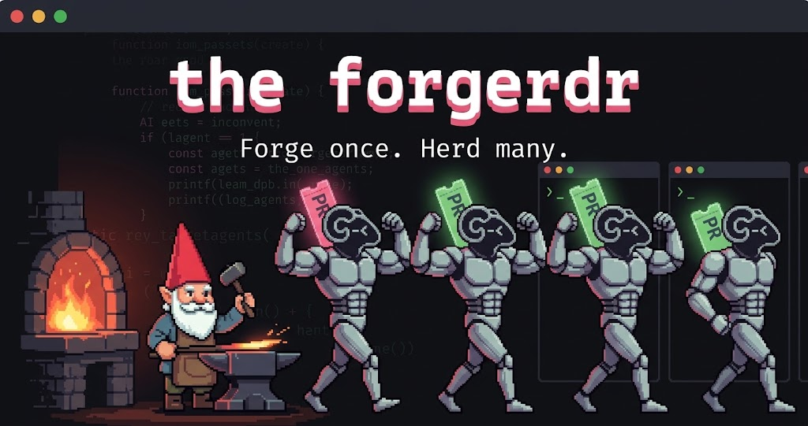

<p align="center">
  <a href="https://github.com/Gn0m0-dei/the-forgerdr">
    
  </a>
</p>

<h1 align="center">the forgerdr</h1>

<p align="center">
  <strong>Forge once. Herd many.</strong>
</p>

<p align="center">
  <a href="./LICENSE"></a>
  <a href="#install"></a>
  <a href="#install"></a>
  <a href="./CHANGELOG.md"></a>
</p>

A Claude Code plugin and a [herdr](https://herdr.dev) plugin that carry a whole way of working: coding standards, a terse communication mode, a lazy build philosophy, a persistent-memory protocol, a spec → plan → build flow, an interactive pull request reviewer, a backlog item workflow, and the two things that make a terminal full of agents worth it: fan out N pull requests into N panes, fan out N backlog items into N worktrees, each with its env files, its dev server and its own agent.

| Layer | Pieces | What it gives |
|---|---|---|
| Rules, every session | standards · communication · build · memory | one way of coding, talking, building and remembering |
| Design to delivery | `spec` → `plan` → `build` → `ship` | design gate, TDD plan, verified execution, pull request |
| One at a time | `pr-review` · `ticket` · `debug` · `security` · `research` · `address-review` | interactive and gated, with fresh-context agents where a second pair of eyes helps |
| Many at a time, on herdr | `review` · `work` | N panes, N worktrees, N agents |

## Install

Fresh machine, macOS or openSUSE Tumbleweed:

```bash
curl -fsSL https://raw.githubusercontent.com/Gn0m0-dei/the-forgerdr/main/install.sh | bash
```

That puts the tools on the machine, each step skipped when the tool is already there: git, jq, node, pnpm, `az` with the azure-devops extension, `gh`, `glab`, the [engram](https://github.com/Gentleman-Programming/engram) binary, [herdr](https://herdr.dev), Claude Code and the [codebase-memory-mcp](https://github.com/DeusData/codebase-memory-mcp) binary. Another distro: install those by hand.

Then, inside Claude Code:

```
/plugin marketplace add Gn0m0-dei/the-forgerdr
/plugin install forgerdr@the-forgerdr
/forgerdr:setup
```

`/forgerdr:setup` completes the rest and reports a table: engram server, the MCP servers reaching through the plugin, herdr plugins, keybindings and Claude integration, provider sign-ins (yours to run), Claude Code settings, and the leftovers the plugin now replaces.

Local checkout instead of the marketplace: `claude --plugin-dir /path/to/the-forgerdr` and `herdr plugin link /path/to/the-forgerdr/herdr`.

### Memory and MCP servers travel with the plugin

`mcp-servers.json` declares the four MCP servers the way of working depends on, so nothing is registered by hand: **engram** (through `bin/engram-mcp.sh`, which scopes the server to the memory project key), **codebase-memory** (the code graph), **context7** (official library docs; export `CONTEXT7_API_KEY` for a higher rate limit) and **chrome-devtools** (browser verification). The engram and codebase-memory binaries are the only pieces outside the plugin; `install.sh` brings them like any other CLI.

Memory lives in `~/.engram/engram.db` and in Claude Code's own memory directory. A new machine starts empty unless you copy both.

## What runs on every session

`hooks/session-start.sh` injects the four rule files, resolves the **memory project key** (the workspace root when the repository sits in a workspace, a parent with its own `.claude`, `CLAUDE.md` or `AGENTS.md`; the repository otherwise), starts the engram server if it is down, folds the per-directory projects engram used to create into that key, registers the session, and after a compaction brings the project's memory context back. The engram MCP server is started with that same key, so a workspace of four repositories is one memory, not four.

`hooks/guard-bash.sh` refuses, before they run, the commands the standards forbid: a branch created tracking the shared base, `git reset --hard` or `--mixed`, a force push, `pkill -f` and `killall`. `hooks/graph-augment.sh` adds code-graph context to every Grep and Glob. `hooks/engram-session.sh` closes the engram session on stop and captures subagent output.

| Rule file | What it fixes |
|---|---|
| `rules/standards.md` | English in the repo, Spanish in chat, zero AI attribution, typing, style, error handling, git and pull request conventions |
| `rules/communication.md` | Terse replies, verdict first, full prose only where clarity needs it (warnings, drafts, review findings) |
| `rules/build.md` | The lazy ladder: nothing → reuse → stdlib → platform → installed dependency → one line → minimal code |
| `rules/memory.md` | When to search, when to save, what to save, how to close a session |

## Skills

| Skill | What it does |
|---|---|
| `/forgerdr:setup` | Installs and verifies the environment. Idempotent. |
| `/forgerdr:spec` | Classifies the request (spike, bounded, architectural), asks what matters, presents the design and stops for approval. Architectural work ends in `docs/specs/`. |
| `/forgerdr:plan` | Turns an approved spec into bite-sized TDD tasks with exact files, interfaces and tests, in `docs/plans/`. |
| `/forgerdr:build` | Executes a plan in this session: red, green, refactor, ledger, verification before every claim, fresh-context review at the end. |
| `/forgerdr:pr-review <url>` | Reviews one pull request against the standards and the project skills. Every finding explained; you pick; drafts in Spanish; nothing published without an explicit yes. |
| `/forgerdr:ticket <url>` | Works one backlog item: triage, reproduce in the browser, root cause, proposal, branch without tracking, pull request, client-facing comment. Six gates, none skipped. |
| `/forgerdr:address-review <url>` | Handles the comments on your own pull request: proposes fix, reply or question per thread; you pick; fixes, pushes, replies and resolves. |
| `/forgerdr:ship` | Finishes a branch: fresh verification, rebase, reviewer agent, commit with permission, `push -u`, pull request with the work item linked. |
| `/forgerdr:debug` | Root cause before any fix: investigate, pattern, one hypothesis at a time, regression test proven red then green. |
| `/forgerdr:security` | Runs the security auditor on the diff or a module, triages the findings with you, fixes only what you pick. |
| `/forgerdr:research` | Cited research report: sub-questions, one researcher agent each in parallel, synthesis with confidence levels. |
| `/forgerdr:review <url...>` | herdr: a tab with one pane and one Claude agent per pull request, each running `pr-review`. |
| `/forgerdr:work <url...>` | herdr: per item and repository, a worktree on `fix/#id-slug` or `feature/#id-slug` from `origin/develop` (or the remote HEAD), the main clone's ignored `.env*` files copied over, the dev server on its own `PORT`, and a Claude agent running `ticket`. |

Providers are reached through their CLIs, never through MCP servers: `references/providers.md` holds the exact commands for Azure DevOps, GitHub and GitLab.

## Agents

Three read-only subagents the skills dispatch for a fresh context, without a dialogue:

| Agent | Dispatched by | Returns |
|---|---|---|
| `forgerdr:reviewer` | `build` (end of plan, or each task in agent mode), `ship` | findings graded critical / important / minor with file and line, verdict |
| `forgerdr:security-auditor` | `security` | checklist findings with severity, proof and fix |
| `forgerdr:researcher` | `research`, one per sub-question | cited answer with confidence |

Two kinds of agents, on purpose. Subagents run inside the session, cost a fresh context and leave nothing behind: right for review, audit and research. herdr panes run a whole Claude you can watch and talk to: right for `pr-review` and `ticket`, which stop for your answers, and for `build` when you want to see a task happen. Tasks of one plan run sequentially either way: one branch, one worktree, one editor at a time.

## herdr plugin

`herdr/` is a herdr plugin (`gn0m0dei.forgerdr`) with the same two fan-outs as actions, so they also work without a Claude session open:

| Action | Keybinding (after `setup-keys`) | What it does |
|---|---|---|
| `review` | `prefix+shift+p` | Opens a pane that asks for pull request URLs and runs `bin/forge-review.sh` |
| `work` | `prefix+shift+t` | Opens a pane that asks for item URLs and runs `bin/forge-work.sh` |
| `setup-keys` | | Writes the two keybindings into `~/.config/herdr/config.toml` (managed block) and reloads |

The scripts are plain bash over the herdr CLI and `jq`:

```bash
herdr/bin/forge-work.sh   [--repo PATH]... [--base BRANCH] [--dev COMMAND] [--port-base N] [--no-agent] <item-url>...
herdr/bin/forge-review.sh [--cwd PATH] [--no-agent] <pr-url>...
```

Both print one JSON line per worktree or pane. What they cannot guess (which repositories an item touches in a multi-repo workspace, which `dev:<app>` script of a monorepo) the Claude skills decide and pass as flags; from the herdr action, the defaults apply: every repository under the current directory, and a dev server only when `package.json` has a single `dev` script.

## Development

```bash
pnpm install
pnpm lint       # biome + shellcheck (install.sh, bin, hooks, herdr/bin, test)
pnpm test       # bash test/forge-lib.test.sh: the pure functions of the scripts
pnpm validate   # claude plugin validate .
```

The fan-out scripts are exercised by hand inside herdr (`--no-agent` creates the topology without starting agents). Say in the pull request what you ran.

## License

MIT.
